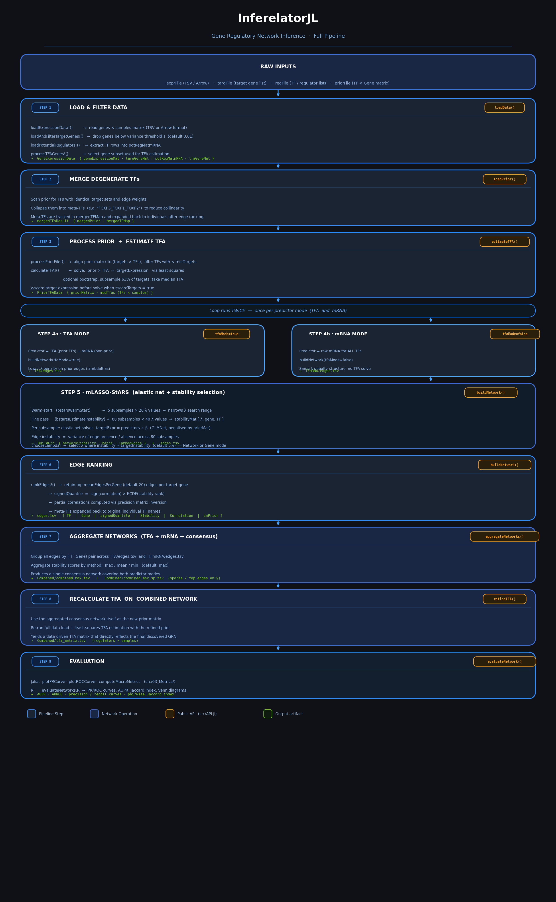

# InferelatorJL

A Julia package for inference of transcriptional regulatory networks (GRNs) from
gene expression data and prior chromatin accessibility or binding information,
using the **mLASSO-StARS** algorithm.



---

## Overview

InferelatorJL infers genome-scale gene regulatory networks (GRNs) by combining
gene expression data with a prior network (e.g., from ATAC-seq or ChIP-seq) to
identify transcription factor (TF) → target gene regulatory relationships.
The method uses **multi-scale LASSO with Stability Approach to Regularization
Selection (mLASSO-StARS)**, a penalized regression framework in which the prior
network biases edge selection and stability selection across bootstrap subsamples
determines a data-driven sparsity level.

**Key features:**

- Supports bulk RNA-seq, pseudobulk, and single-cell expression data
- Estimates **TF activity (TFA)** via least squares as an alternative to raw TF mRNA
- Builds separate networks for TFA and TF mRNA predictors, then combines them
- Prior-weighted LASSO penalties reduce false positives for prior-supported edges
- Network-level or gene-level instability thresholding
- Built-in PR / ROC evaluation against gold-standard interaction sets
- Fully multithreaded subsampling loop

---

## Installation

**Requirements:** Julia ≥ 1.7, Python (for PyPlot/matplotlib)

```julia
# From the Julia REPL:
] add https://github.com/miraldilab/InferelatorJL.jl

# Install all dependencies:
] instantiate
```

**For development / local installation:**
```julia
] dev /path/to/InferelatorJL
] instantiate
```

---

## Quick start

```julia
using InferelatorJL

# Step 1 — load expression data
data = loadData(exprFile, targFile, regFile)

# Steps 2–3 — merge degenerate TFs, build prior, estimate TFA
priorData, mergedTFs = loadPrior(data, priorFile)
estimateTFA(priorData, data; outputDir = dirOut)

# Step 3b (optional) — apply time-lag correction (time-series data only)
# applyTimeLag(priorData, data, timeLagFile, timeLag)

# Step 4 — infer GRN (TFA predictors)
buildNetwork(data, priorData;
             tfaMode   = true,
             outputDir = joinpath(dirOut, "TFA"))

# Step 5 — aggregate TFA + mRNA networks
aggregateNetworks([tfaEdges, mrnaEdges];
                  method    = :max,
                  outputDir = joinpath(dirOut, "Combined"))

# Step 6 — refine TFA using the consensus network as a new prior
refineTFA(combinedNetFile, data, mergedTFs; outputDir = dirOut)

# Step 7 — evaluate against a gold standard
evaluateNetwork(networkFile, goldStandard;
                gsRegsFile = regFile, targGeneFile = targFile, saveDir = dirPR)
```

See [`examples/interactive_pipeline.jl`](examples/interactive_pipeline.jl) for a
fully annotated step-by-step example.

---

## Pipeline

The full pipeline has seven steps. Each step is a single function call.

| Step | Function | Description |
|---|---|---|
| 1 | `loadData` | Load expression matrix; filter to target genes and regulators |
| 2–3 | `loadPrior` + `estimateTFA` | Process prior, merge degenerate TFs, estimate TF activity via least squares |
| 3b *(optional)* | `applyTimeLag` | Adjust TFA and TF mRNA for the delay between TF transcription and protein activity (time-series data only) |
| 4 | `buildNetwork` | Run mLASSO-StARS for one predictor mode (TFA or TF mRNA) |
| 5 | `aggregateNetworks` | Combine TFA and mRNA edge lists into a consensus network |
| 6 | `refineTFA` | Re-estimate TFA using the consensus network as a data-driven prior |
| 7 | `evaluateNetwork` | Evaluate any network against gold standards (PR/ROC curves) |

Steps 4–6 are typically run twice (TFA mode and TF mRNA mode) and the results
aggregated in Step 5.

---

## Input files

| File | Format | Description |
|---|---|---|
| Expression matrix | Tab-delimited TSV or Apache Arrow | Genes × samples; genes in rows, samples in columns; first column is gene names |
| Target gene list | Plain text, one gene per line | Genes to model as regression targets |
| Regulator list | Plain text, one TF per line | Candidate transcription factors |
| Prior network | Sparse TSV (TF × gene, empty first header) | Prior regulatory connections; values are edge weights (binary or continuous) |
| Prior penalties | Same format as prior network | Prior(s) used to set per-edge LASSO penalties; can be the same as prior network |
| TFA gene list | Plain text, one gene per line | Optional: restrict TFA estimation to a gene subset |

---

## Output files

All outputs are written under the directory specified by `outputDir`.

| File | Description |
|---|---|
| `edges.tsv` | Full ranked edge table: TF, gene, signed quantile, stability, partial correlation, inPrior flag |
| `edges_subset.tsv` | Top edges after applying the `meanEdgesPerGene` cap |
| `instabOutMat.jld` | Serialised `GrnData` struct with full instability arrays across the λ grid |
| `instability_diagnostic_network.png` | Two-panel plot: model size vs λ (left) and bStARS instability bounds vs λ (right) |
| `instability_selection_network.png` | \|Instability − target\| vs λ with dot at the chosen λ |
| `combined_<method>.tsv` | Aggregated network (long format) |
| `combined_<method>_sp.tsv` | Aggregated network (sparse prior format, for downstream use) |

---

## Key parameters

| Parameter | Default | Description |
|---|---|---|
| `totSS` | 80 | Total bootstrap subsamples for instability estimation |
| `subsampleFrac` | 0.63 | Fraction of samples drawn per subsample |
| `targetInstability` | 0.05 | Instability threshold for λ selection |
| `lambdaBias` | `[0.5]` | Penalty reduction factor for prior-supported edges (0 = no prior, 1 = uniform) |
| `meanEdgesPerGene` | 20 | Maximum retained edges per target gene |
| `instabilityLevel` | `"Network"` | `"Network"`: single λ for all genes; `"Gene"`: per-gene λ |
| `zScoreTFA` | `true` | Z-score expression before TFA estimation |
| `zScoreLASSO` | `true` | Z-score expression before LASSO regression |
| `method` | `:max` | Network aggregation rule: `:max`, `:mean`, or `:min` stability |
| `timeLagFile` | `""` | Path to 4-column TSV (sampleQ, timeQ, sampleP, timeP) for time-lag correction; `""` skips step 3b |
| `timeLag` | `0.0` | Lag between TF mRNA and protein activity, in the same time units as `timeLagFile` |

---

## API reference

### Data loading
```julia
data                    = loadData(exprFile, targFile, regFile; tfaGeneFile="", epsilon=0.01)
priorData, mergedTFs    = loadPrior(data, priorFile; minTargets=3)
```

### Core pipeline
```julia
estimateTFA(priorData, data; edgeSS=0, zScoreTFA=true, outputDir=".")
applyTimeLag(priorData, data, timeLagFile, timeLag)          # optional step 3b
buildNetwork(data, priorData; tfaMode=true, totSS=80, lambdaBias=[0.5], ...)
aggregateNetworks(netFiles; method=:max, meanEdgesPerGene=20, outputDir=".")
refineTFA(combinedNetFile, data, mergedTFs; zScoreTFA=true, outputDir=".")
```

### Evaluation
```julia
evaluateNetwork(networkFile, goldStandard;
                gsRegsFile="", targGeneFile="", doPerTF=false, saveDir="")
```

### Utilities
```julia
convertToLong(df)                            # wide prior matrix → long format
convertToWide(df; indices=(2,1,3))           # long → wide
frobeniusNormalize(M, :column)               # normalize matrix columns or rows
binarizeNumeric!(df)                         # continuous prior → binary
mergeDFs(dfs, :Gene, "sum")                  # merge prior DataFrames
completeDF(df, :Gene, allGenes, allTFs)      # align to full gene/TF universe
writeTSVWithEmptyFirstHeader(df, path)       # write sparse prior format
check_column_norms(M)                        # verify unit column norms
writeNetworkTable!(buildGrn; outputDir=".")  # write edges.tsv from BuildGrn struct
saveData(data, tfaData, grnData, buildGrn, dir, "checkpoint.jld2")
```

---

## Examples

| File | Description |
|---|---|
| [`interactive_pipeline.jl`](examples/interactive_pipeline.jl) | Full 7-step pipeline, step-by-step in the REPL, public API only |
| [`interactive_pipeline_dev.jl`](examples/interactive_pipeline_dev.jl) | Same pipeline using module-qualified internal calls (for development/debugging) |
| [`run_pipeline.jl`](examples/run_pipeline.jl) | Full pipeline wrapped in `runInferelator()` for batch/cluster use, public API |
| [`run_pipeline_dev.jl`](examples/run_pipeline_dev.jl) | Same wrapped function using internal calls |
| [`utilityExamples.jl`](examples/utilityExamples.jl) | All utility functions demonstrated with synthetic data; no input files needed |
| [`plotPR.jl`](examples/plotPR.jl) | Standalone script to load saved PR results and generate PR curve plots |

---

## Data structures

| Struct | Populated by | Key fields |
|---|---|---|
| `GeneExpressionData` | `loadData` | `expressionMat`, `geneNames`, `sampleNames`, `tfNames` |
| `PriorTFAData` | `loadPrior`, `estimateTFA` | `priorMat`, `medTfas`, `tfNames`, `targetGenes` |
| `mergedTFsResult` | `loadPrior` | `mergedTFs`, `tfNames`, `mergeTfLocVec` |
| `GrnData` | `buildNetwork` internals | `predictorMat`, `penaltyMat`, `stabilityMat`, `subsampleMat` |
| `BuildGrn` | `buildNetwork` | `regs`, `targs`, `signedQuantile`, `rankings`, `networkMat` |

---

## Citation

If you use InferelatorJL in your work, please cite:

> Miraldi ER, Pokrovskii M, Watters A, et al.
> **Leveraging chromatin accessibility for transcriptional regulatory network inference in T Helper 17 Cells.**
> *PLOS Computational Biology*, 2019.
> https://doi.org/10.1371/journal.pcbi.1006979

---

## License

See [LICENSE](LICENSE) for details.
