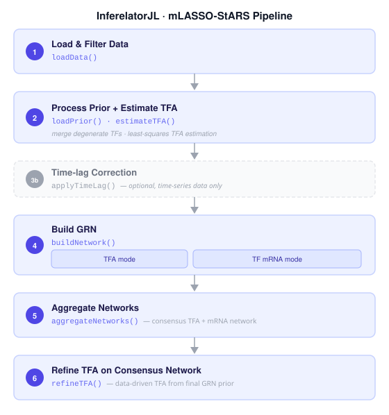

# InferelatorJL

A Julia package for inference of transcriptional regulatory networks (GRNs) from
gene expression data and prior chromatin accessibility or binding information,
using the **mLASSO-StARS** algorithm.



---

## Overview

InferelatorJL infers genome-scale gene regulatory networks (GRNs) by combining
gene expression data with a prior network (e.g., from ATAC-seq or ChIP-seq) to
identify transcription factor (TF) → target gene regulatory relationships.
The core method is **multi-scale LASSO with Stability Approach to Regularization
Selection (mLASSO-StARS)**, a penalized regression framework in which the prior
network biases edge selection and bootstrap stability across subsamples determines
a data-driven sparsity level. Two additional model-selection methods are available
as alternatives to bStARS: **EBIC** (single-fit, fast) and **bEBIC** (bootstrap EBIC,
produces selection-count confidence scores directly comparable to bStARS).

**Key features:**

- Supports bulk RNA-seq, pseudobulk, and single-cell expression data
- Estimates **TF activity (TFA)** via least squares as an alternative to raw TF mRNA
- Builds separate networks for TFA and TF mRNA predictors, then combines them
- Prior-weighted LASSO penalties reduce false positives for prior-supported edges
- Three model-selection methods: `bStARS` (default), `EBIC`, `bEBIC`
- Network-level or gene-level instability thresholding (bStARS)
- Built-in PR / ROC evaluation against gold-standard interaction sets
- Fully multithreaded subsampling loop

---

## Installation

**Requirements:** Julia ≥ 1.7, Python (for PyPlot/matplotlib)

```julia
# From the Julia REPL:
] add https://github.com/miraldilab/InferelatorJL.jl

# Install all dependencies:
] instantiate
```

**For development / local installation:**
```julia
] dev /path/to/InferelatorJL
] instantiate
```

---

## Quick start

```julia
using InferelatorJL

# Step 1 — load expression data
data = loadData(exprFile, targFile, regFile)

# Steps 2–3 — merge degenerate TFs, build prior, estimate TFA
priorData, mergedTFs = loadPrior(data, priorFile)
estimateTFA(priorData, data; outputDir = dirOut)

# Step 3b (optional) — apply time-lag correction (time-series data only)
# applyTimeLag(priorData, data, timeLagFile, timeLag)

# Step 4 — infer GRN (TFA predictors)
buildNetwork(data, priorData;
             tfaMode   = true,
             outputDir = joinpath(dirOut, "TFA"))

# Step 5 — aggregate TFA + mRNA networks
aggregateNetworks([tfaEdges, mrnaEdges];
                  method    = :max,
                  outputDir = joinpath(dirOut, "Combined"))

# Step 6 — refine TFA using the consensus network as a new prior
refineTFA(combinedNetFile, data, mergedTFs; outputDir = dirOut)

# Step 7 — evaluate against a gold standard
evaluateNetwork(networkFile, goldStandard;
                gsRegsFile = regFile, targGeneFile = targFile, saveDir = dirPR)
```

See [`examples/interactive_pipeline.jl`](examples/interactive_pipeline.jl) for a
fully annotated step-by-step example.

---

## Pipeline

The full pipeline has seven steps. Each step is a single function call.

| Step | Function | Description |
|---|---|---|
| 1 | `loadData` | Load expression matrix; filter to target genes and regulators |
| 2–3 | `loadPrior` + `estimateTFA` | Process prior, merge degenerate TFs, estimate TF activity via least squares |
| 3b *(optional)* | `applyTimeLag` | Adjust TFA and TF mRNA for the delay between TF transcription and protein activity (time-series data only) |
| 4 | `buildNetwork` | Infer GRN for one predictor mode (TFA or TF mRNA); model selection via `bStARS`, `EBIC`, or `bEBIC` |
| 5 | `aggregateNetworks` | Combine TFA and mRNA edge lists into a consensus network |
| 6 | `refineTFA` | Re-estimate TFA using the consensus network as a data-driven prior |
| 7 | `evaluateNetwork` | Evaluate any network against gold standards (PR/ROC curves) |

Steps 4–6 are typically run twice (TFA mode and TF mRNA mode) and the results
aggregated in Step 5.

---

## Input files

| File | Format | Description |
|---|---|---|
| Expression matrix | Tab-delimited TSV or Apache Arrow | Genes × samples; genes in rows, samples in columns; first column is gene names |
| Target gene list | Plain text, one gene per line | Genes to model as regression targets |
| Regulator list | Plain text, one TF per line | Candidate transcription factors |
| Prior network | Wide-matrix TSV (gene × TF, empty first header) | Prior regulatory connections; rows = target genes, columns = TFs; values are edge weights (binary or continuous) |
| Prior penalties | Same format as prior network | Prior(s) used to set per-edge LASSO penalties; can be the same as prior network |
| TFA gene list | Plain text, one gene per line | Optional: restrict TFA estimation to a gene subset |

---

## Output files

All outputs are written under the directory specified by `outputDir`.

| File | Method | Description |
|---|---|---|
| `edges.tsv` | all | Full ranked edge table: TF, gene, signed quantile, stability, partial correlation, inPrior flag |
| `edges_subset.tsv` | all | Top edges after applying the `meanEdgesPerGene` cap |
| `grnOutMat.jld` | all | Serialised `BuildGrn` struct (full network object) |
| `instabOutMat.jld` | bStARS | Serialised `GrnData` struct with full stability arrays across the λ grid. Load with `JLD2.load_object` and pass to `plotInstabilityCurves` for on-demand λ selection diagnostics |
| `bebicOutMat.jld` | bEBIC | Serialised `GrnData` struct — preserves `lambdaSS` (nGenes × totSS per-subsample lambda matrix) for post-hoc analysis |
| `bebic_lambda_summary.tsv` | bEBIC | Per-gene median and std of EBIC-optimal lambdas across subsamples |
| `ebic_lambda_summary.tsv` | EBIC | Per-gene chosen lambda and number of non-zero coefficients at that lambda |
| `combined_<method>_sp.tsv` | all | Aggregated network — long/edge list format (TF, gene, score; no zeros) |
| `combined_<method>.tsv` | all | Aggregated network — wide/matrix format (genes × TFs; used as prior input to `refineTFA`) |

---

## Key parameters

| Parameter | Default | Description |
|---|---|---|
| `modelSelection` | `"bStARS"` | Lambda selection method: `"bStARS"` (stability-based, default), `"EBIC"` (single-fit, fast), `"bEBIC"` (bootstrap EBIC, produces bStARS-comparable confidence scores) |
| `totSS` | 80 | Total bootstrap subsamples (bStARS and bEBIC) |
| `subsampleFrac` | 0.63 | Fraction of samples drawn per subsample (bStARS and bEBIC) |
| `targetInstability` | 0.05 | Instability threshold for λ selection (bStARS only) |
| `gamma` | `0.5` | EBIC sparsity hyperparameter (EBIC and bEBIC only); `0` = standard BIC, `0.5` = recommended for GRN, `1` = maximum sparsity penalty |
| `minLambda` | `nothing` | Lower bound of the λ grid. `nothing` = auto-computed per gene as `max\|X'y\|/n × ε`. Pass a `Float64` to fix the lower bound manually. |
| `maxLambda` | `nothing` | Upper bound of the λ grid. `nothing` = auto-computed per gene as `max\|X'y\|/n`. Pass a `Float64` to fix the upper bound manually. |
| `lambdaBias` | `[0.5]` | Penalty reduction factor for prior-supported edges (0 = no prior, 1 = uniform) |
| `meanEdgesPerGene` | 20 | Maximum retained edges per target gene |
| `instabilityLevel` | `"Network"` | `"Network"`: single λ for all genes; `"Gene"`: per-gene λ (bStARS only) |
| `zScoreTFA` | `false` | Z-score expression before TFA estimation |
| `zScoreLASSO` | `false` | Z-score expression before LASSO regression. Set `true` to z-score the response; note that empirically z-scoring can be required for EBIC/bEBIC to avoid null models on some datasets |
| `method` | `:max` | Network aggregation rule: `:max`, `:mean`, or `:min` stability |
| `timeLagFile` | `""` | Path to 4-column TSV (sampleQ, timeQ, sampleP, timeP) for time-lag correction; `""` skips step 3b |
| `timeLag` | `0.0` | Lag between TF mRNA and protein activity, in the same time units as `timeLagFile` |
| `leaveOutSampleList` | `""` | Path to a text file (one sample name per line) listing samples to exclude from subsampling; held-out samples form the test set for `calcR2predFromStabilities` |

---

## API reference

### Data loading
```julia
data                    = loadData(exprFile, targFile, regFile; tfaGeneFile="", epsilon=0.01)
priorData, mergedTFs    = loadPrior(data, priorFile; minTargets=3)
```

### Core pipeline
```julia
estimateTFA(priorData, data; edgeSS=0, zScoreTFA=false, outputDir=".")
applyTimeLag(priorData, data, timeLagFile, timeLag)          # optional step 3b
buildNetwork(data, priorData; tfaMode=true, totSS=80, lambdaBias=[0.5], ...)
aggregateNetworks(netFiles; method=:max, meanEdgesPerGene=20, outputDir=".")
refineTFA(combinedNetFile, data, mergedTFs; zScoreTFA=false, outputDir=".")
```

### Internal — bEBIC (dev scripts only)

`buildNetwork` calls these internally when `modelSelection = "bEBIC"`. Use them
directly in dev scripts when you need to inspect `grnData.lambdaSS` or pass a
custom `outputDir`.

```julia
# Expensive step: LASSO on every subsample per gene, EBIC selects optimal λ
# Fills: grnData.lambdaSS (nGenes × totSS), buildGrn.networkStability (selection counts)
# Writes bebicOutMat.jld + bebic_lambda_summary.tsv when outputDir is set
constructSubsamples(data, grnData; totSS=80, subsampleFrac=0.63)
bebicEstimateLambdas!(grnData, buildGrn; gamma=0.5, zScoreLASSO=false, outputDir=".")
```

`bebicFinalFit!` is **optional** — it performs a final full-data LASSO fit to
produce signed coefficients (`buildGrn.betas`), which `rankEdges!` does not use.
Call it only if you need LASSO effect-size estimates for post-hoc analysis:

```julia
# Optional post-hoc: aggregate per-subsample λ → one per gene, final full-data fit
# Fills: buildGrn.lambda, buildGrn.betas, grnData.ebicLambdas
bebicFinalFit!(grnData, buildGrn; aggregateFn=median, zScoreLASSO=false)
```

### Evaluation
```julia
evaluateNetwork(networkFile, goldStandard;
                gsRegsFile="", targGeneFile="", doPerTF=false, saveDir="")

# Out-of-sample R² prediction: sweep model sizes 1:maxModSize TFs/gene,
# fit OLS on training samples, evaluate on held-out test samples.
# Requires a leave-out set (passed via leaveOutSampleList in buildNetwork).
calcR2predFromStabilities(grnData, buildGrn, data, maxModSize, outputDir;
                          xaxisStepSize=5)
```

### Data preparation (pseudobulk)
```julia
# Aggregate single-cell counts from an AnnData (.h5ad) object into pseudobulk
pbRaw = pseudoBulk(adata, "celltype_rep")   # returns features × samples DataFrame

# Normalize a features × samples count matrix
# methods: "none", "tpm", "log2tpm", "zscore", "log2tpm_zscore", "log2fc", "sizefactor"
countsNorm = normalizeMatrix(countsMat, "log2tpm")

# Build a one-hot biological covariate matrix (drop-first encoding)
bioDesign = buildDesignMatrix(meta, "celltype")

# Remove additive batch effects (pure Julia OLS, equivalent to limma)
corrected = removeBatchEffect(countsNorm, meta[!, "replicate"]; designMat=bioDesign)

# Sum replicate columns into per-celltype aggregate columns
# Column names must follow {celltype}_{replicate} convention
limaAgg = aggregateReplicates(limaDf, celltypeOrder, replicateOrder)
```

For DESeq2 VST normalization and exact limma batch correction, use R directly.
See [`examples/prepareData/pseudobulkWorkflow.jl`](examples/prepareData/pseudobulkWorkflow.jl)
for a complete workflow using RCall.jl.

### Utilities
```julia
matrixToEdgeList(df)                         # wide prior matrix → edge list (long format, no zeros)
edgeListToMatrix(df; indices=(2,1,3))        # edge list → wide matrix
frobeniusNormalize(M, :column)               # normalize matrix columns or rows
binarizeNumeric!(df)                         # continuous prior → binary
mergeDFs(dfs, :Gene, "sum")                  # merge prior DataFrames
completeDF(df, :Gene, allGenes, allTFs)      # align to full gene/TF universe
writeTSVWithEmptyFirstHeader(df, path)       # write sparse prior format
check_column_norms(M)                        # verify unit column norms
writeNetworkTable!(buildGrn; outputDir=".")  # write edges.tsv from BuildGrn struct
saveData(data, tfaData, grnData, buildGrn, dir, "checkpoint.jld2")
```

---

## Examples

| File | Description |
|---|---|
| [`interactive_pipeline.jl`](examples/interactive_pipeline.jl) | Full 7-step pipeline, step-by-step in the REPL, public API only |
| [`interactive_pipeline_dev.jl`](examples/interactive_pipeline_dev.jl) | Same pipeline using module-qualified internal calls (for development/debugging) |
| [`run_pipeline.jl`](examples/run_pipeline.jl) | Full pipeline wrapped in `runInferelator()` for batch/cluster use, public API |
| [`run_pipeline_dev.jl`](examples/run_pipeline_dev.jl) | Same wrapped function using internal calls |
| [`dataUtils.jl`](examples/dataUtils.jl) | Data utility and partial-correlation functions demonstrated with synthetic data; no input files needed |
| [`networkUtils.jl`](examples/networkUtils.jl) | Network I/O and aggregation utilities demonstrated with synthetic data; no input files needed |
| [`plotPR.jl`](examples/plotPR.jl) | Standalone script to load saved PR results and generate PR curve plots |
| [`prepareData/pseudobulkWorkflow.jl`](examples/prepareData/pseudobulkWorkflow.jl) | End-to-end pseudobulk workflow: h5ad → normalize → batch-correct → save TSV/Arrow for InferelatorJL |
| [`prepareData/h5adToArrow.jl`](examples/prepareData/h5adToArrow.jl) | Convert an h5ad expression matrix directly to the Arrow format expected by InferelatorJL |
| [`r2PredWorkflow.jl`](examples/r2PredWorkflow.jl) | Leave-out R² prediction workflow: build GRN with held-out samples, compute R²_pred vs model size to guide TF-per-gene selection |

---

## Data structures

| Struct | Populated by | Key fields |
|---|---|---|
| `GeneExpressionData` | `loadData` | `geneExpressionMat`, `geneNames`, `cellLabels`, `targGenes`, `potRegs` |
| `PriorTFAData` | `loadPrior`, `estimateTFA` | `priorMatrix`, `medTfas`, `pRegs`, `pTargs` |
| `mergedTFsResult` | `loadPrior` | `mergedPrior`, `mergedTFMap` |
| `GrnData` | `buildNetwork` internals | `predictorMat`, `penaltyMat`, `allPredictors`, `subsamps`, `trainInds`, `stabilityMat`, `targGenes`; bEBIC adds `lambdaSS` (nGenes × totSS), `ebicLambdas` (per-gene median λ) |
| `BuildGrn` | `buildNetwork` | `networkMat`, `networkMatSubset` |

---

## Citation

If you use InferelatorJL in your work, please cite:

> Miraldi ER, Pokrovskii M, Watters A, et al.
> **Leveraging chromatin accessibility for transcriptional regulatory network inference in T Helper 17 Cells.**
> *PLOS Computational Biology*, 2019.
> https://doi.org/10.1371/journal.pcbi.1006979

---

## License

See [LICENSE](LICENSE) for details.
